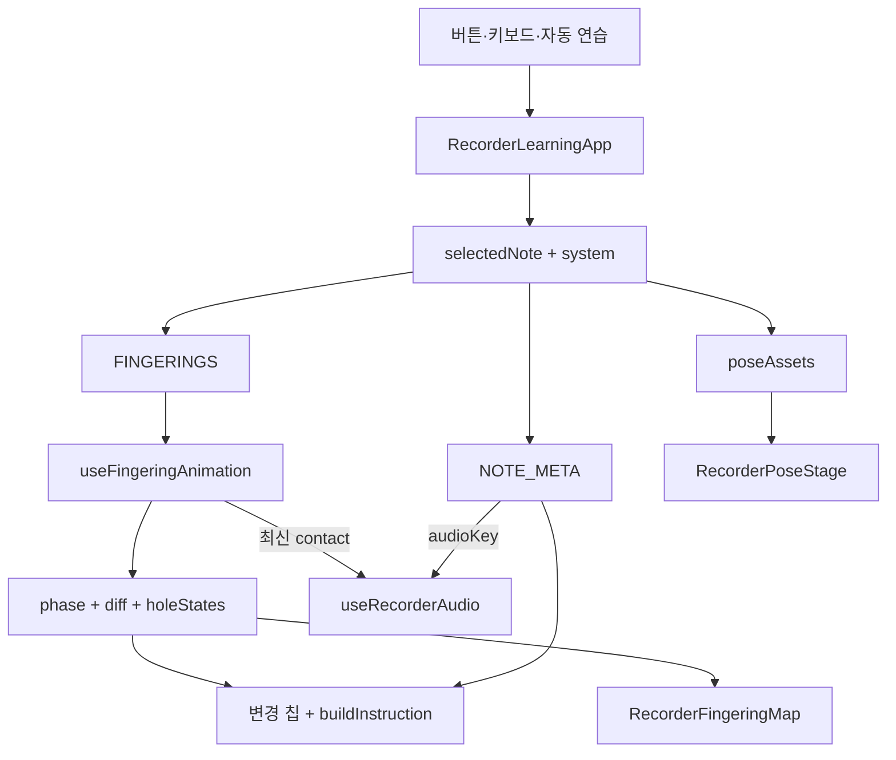

# 아키텍처

이 앱의 핵심 원칙은 **운지 데이터는 한 곳에서 관리하고, 손 포즈·구멍 지도·안내 문구·오디오가 같은 상태에서 파생된다**는 것입니다. 화면은 사용자가 제공한 완성 운지 포즈를 주 시각 자료로 사용하되, 논리 상태와 자동 검증은 기능형 SVG 구멍 지도가 담당합니다.

## 런타임 경계

- `app/page.tsx`는 서버 진입점이며 오류 경계 안에 클라이언트 앱을 렌더링합니다.
- `RecorderLearningApp.tsx`는 선택 음, 운지 체계, 연습 모드, 애니메이션과 오디오 요청을 조정합니다.
- 정렬된 PNG 포즈는 `public/fingering/poses/`에서 정적 제공됩니다.
- `RecorderPoseStage.tsx`는 캔버스에서 현재 포즈와 목표 포즈를 교차 전환합니다.
- `RecorderFingeringMap.tsx`는 현재 구멍 상태와 떼기·막기 강조를 SVG로 그립니다.
- 서버 데이터베이스나 비밀 환경 변수는 필요하지 않으며 설정은 브라우저 `localStorage`에 저장됩니다.

## 주요 디렉터리

```text
app/
  page.tsx                         # 페이지 진입점
  globals.css                      # 반응형 장면과 모션 스타일
public/fingering/poses/
  *.png                            # 같은 프레임으로 정렬된 완성 운지 포즈
src/features/recorder/
  model/types.ts                   # 도메인 타입
  data/
    fingerings.ts                  # 음·체계별 닫힌 구멍의 단일 진실 공급원
    noteMeta.ts                    # 버튼·계이름·음 이름·audioKey
    poseAssets.ts                  # 음·체계별 포즈 파일 매핑
  animation/
    getFingeringDiff.ts            # 현재/목표 운지 차이
    motionTimings.ts               # 속도별 phase 시간
    useFingeringAnimation.ts       # 취소 가능한 상태 머신
  audio/
    RecorderAudioEngine.ts         # 오디오 추상화
    WebAudioRecorderEngine.ts      # 합성 연습음 구현
    useRecorderAudio.ts            # unlock, 음소거, 요청 취소
  components/
    RecorderLearningApp.tsx        # 상위 상태와 이벤트 조정
    RecorderScene.tsx              # 포즈·지도·변경 칩 조합
    RecorderPoseStage.tsx          # 캔버스 포즈 전환
    RecorderFingeringMap.tsx       # 기능형 앞면/뒷면 구멍 지도
  utils/
    buildInstruction.ts            # 한국어 안내 생성
    storage.ts                     # 설정 직렬화
```

## 도메인 모델

- `UiButtonNumber`: 음 선택 번호 `1 | ... | 8`
- `SolfegeId`: `do | re | mi | fa | sol | la | si | highDo`
- `HoleId`: `T0 | L1 | L2 | L3 | R4 | R5 | R6 | R7`
- `FingeringSystem`: `baroque | german`
- `HoleState`: `open | closed | half | partial`

`FINGERINGS[system][note]`에는 막아야 하는 구멍만 들어갑니다. `ALL_HOLES`의 순서가 SVG 상태, 변화 목록, 한국어 안내와 라이브 영역의 공통 읽기 순서입니다. 현재 바로크식과 독일식은 파에서만 다릅니다.

## 데이터 흐름



상위 컴포넌트는 별도의 목표 구멍 사본을 저장하지 않고 선택 음과 체계에서 `targetClosedHoles`와 `poseSource`를 파생합니다. 그 결과 음 카드, 포즈, 지도, 설명과 오디오가 같은 선택을 바라봅니다.

## 취소 가능한 운지 전환

`getFingeringDiff(previous, next)`는 `toOpen`, `toClose`, `stayClosed`, `stayOpen`을 만듭니다. `useFingeringAnimation`은 과거 목표가 아니라 현재 화면에 실제로 커밋된 `visualRef.current`를 새 diff의 시작점으로 사용합니다.

기본 phase 흐름은 다음과 같습니다.

```text
highlight-release → releasing → highlight-press → pressing → contact → settled
```

없는 구간은 건너뛰며 단계별 보기에서는 사용자가 phase를 한 단계씩 진행합니다. 새 전환이 시작되면 기존 타이머를 모두 해제하고 단조 증가 request ID를 바꿉니다. 예약 콜백은 실행 직전에 ID를 다시 검사하므로 빠른 `1→8→4→5` 입력에서도 오래된 전환이 마지막 솔 상태나 오디오를 덮어쓰지 못합니다.

## 포즈 캔버스 전환

`RecorderPoseStage`는 마운트 때 모든 포즈의 preload를 시작하고, 현재 목표가 준비되는 대로 다음 규칙으로 표시합니다.

1. 최초 포즈는 즉시 캔버스에 그립니다.
2. 음이 바뀌면 현재 캔버스의 실제 혼합 프레임을 스냅샷합니다.
3. 스냅샷과 목표 포즈를 `easeOutQuint`로 교차 전환합니다.
4. 보통은 260ms, 느리게는 720ms를 사용합니다.
5. 새 입력은 기존 `requestAnimationFrame`을 취소하고 사용자가 보고 있던 프레임에서 다시 시작합니다.
6. reduced motion에서는 목표 포즈를 즉시 그립니다.

각 포즈는 동일한 `976×1360` 프레임에 정렬되어 있어야 합니다. 같은 음을 다시 볼 때는 직전 전환 원점 포즈를 먼저 복원한 뒤 목표 포즈로 재생합니다. 캔버스를 사용할 수 없는 환경에서는 최적화된 이미지가 폴백으로 남습니다.

## 기능형 구멍 지도

`RecorderScene`은 전달받은 상태를 여덟 `HoleId` 전체에 대해 정규화한 뒤 `RecorderFingeringMap`에 전달합니다. 지도는 다음을 보장합니다.

- T0은 별도의 뒤쪽 엄지 인셋으로 표시합니다.
- R6/R7은 각각 두 개의 작은 구멍으로 그리지만 논리 상태는 하나씩입니다.
- 열림/막힘/반구멍/부분 막힘을 한 `HoleState` 모델로 표현합니다.
- `data-hole-id`, `data-hole-state`, `data-hole-transition`으로 상태를 검증할 수 있습니다.
- phase에 맞춰 떼기는 파란 점선 링, 막기는 주황 실선 링으로 강조합니다.

완성 포즈는 실제 손 모양을 빠르게 이해시키고, 지도는 정확한 번호·접촉 상태와 전환 의미를 명시합니다. 지도는 `FINGERINGS`에서 파생되지만 포즈 파일은 `poseAssets.ts`가 음·체계로 독립 선택합니다. 따라서 음을 추가하거나 운지를 바꿀 때는 `FINGERINGS`, 포즈 PNG와 매핑을 함께 갱신해 둘 사이의 수동 동기화 계약을 지켜야 합니다.

## 오디오와 요청 ID

브라우저 자동재생 정책 때문에 `AudioContext` 활성화는 지연된 contact가 아니라 사용자의 음 선택 제스처 안에서 시작합니다. 앱, `useRecorderAudio`, Web Audio 엔진이 각각 최신 요청 ID를 확인하며, 음소거·연타·언마운트에서는 보류 재생을 취소합니다. 합성 엔진 생성이나 재생이 실패해도 silent fallback을 사용하므로 시각 학습은 계속됩니다.

## 접근성과 오류 경계

- 선택 음과 닫힌 번호를 polite live region으로 알립니다.
- 전체 장면은 음별 접근성 이름과 설명을 갖는 하나의 이미지로 노출됩니다.
- 포즈와 내부 지도 장식은 보조 기술에서 중복 낭독되지 않습니다.
- 버튼·라디오·스위치는 기본 HTML 컨트롤이고 키보드로 조작할 수 있습니다.
- reduced-motion 변경을 구독해 상태 머신, 캔버스와 CSS에 함께 반영합니다.
- 저장소, 전체화면, Web Audio와 이미지 로드 실패가 앱 전체 오류로 전파되지 않습니다.

## 테스트 경계

- `domain.test.ts`: 운지 데이터, 포즈 매핑, 체계 차이, diff와 안내 문구
- `useFingeringAnimation.test.tsx`: 연타 취소, 단계별 보기, reduced motion, cleanup
- `RecorderAudioEngine.test.ts`: 합성음과 오디오 요청 취소
- `RecorderLearningApp.test.tsx`: 포즈·지도·문구의 앱 동기화
- `recorder-learning.spec.ts`: 8음, 파 포즈 전환, 키보드, 연타와 반응형 화면

자동 테스트와 함께 360×800, 844×390, 데스크톱에서 실제 포즈와 구멍 지도의 정렬·가독성을 확인합니다.
