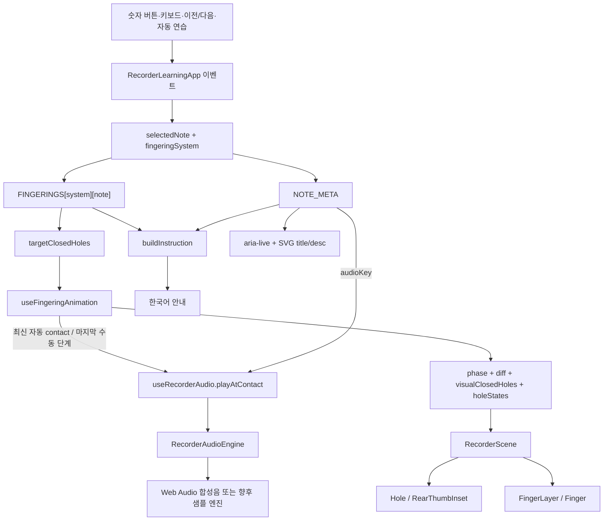
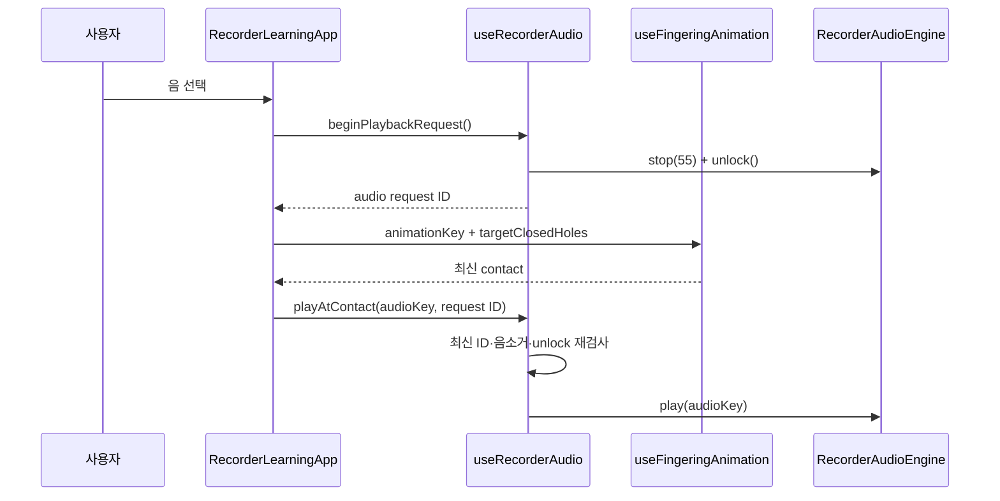

# 아키텍처

이 문서는 리코더 운지법 학습 앱의 데이터 흐름과 빠른 연속 입력을 안전하게 처리하는 취소 모델을 설명합니다. 구현의 중심 원칙은 **운지 데이터는 한 곳에서 관리하고, 화면과 문구와 애니메이션이 그 데이터를 파생해서 사용한다**는 것입니다.

## 런타임 경계

- `app/page.tsx`는 서버 진입점이며 `RecorderErrorBoundary` 안에 클라이언트 앱을 렌더링합니다.
- `RecorderLearningApp.tsx`는 선택 음, 사용자 설정, 연습 모드와 오디오 요청을 조정하는 클라이언트 컨테이너입니다.
- 리코더 그림은 외부 이미지 교체 방식이 아니라 하나의 인라인 SVG 장면입니다.
- 운지 학습 기능에는 서버 데이터베이스나 네트워크 API가 필요하지 않습니다. 설정은 브라우저 `localStorage`에만 저장됩니다.
- 프로덕션 번들은 vinext/Vite가 만들고 `worker/index.ts`의 Cloudflare Worker가 요청을 처리합니다.

## 주요 디렉터리

```text
app/
  page.tsx                         # 페이지 진입점
  globals.css                      # 반응형 레이아웃과 SVG 모션 CSS
src/features/recorder/
  model/types.ts                   # 도메인 타입
  data/
    fingerings.ts                  # 음·체계별 운지 단일 진실 공급원
    noteMeta.ts                    # 버튼·계이름·음 이름·audioKey
    holeLayout.ts                  # SVG 구멍 좌표
    fingerPoses.ts                 # 손가락 자세 좌표와 관절 회전
  animation/
    getFingeringDiff.ts            # 현재/목표 운지 차이
    motionTimings.ts               # 속도별 phase 시간
    useFingeringAnimation.ts       # 취소 가능한 상태 머신과 스케줄러
  audio/
    RecorderAudioEngine.ts         # 오디오 추상화
    WebAudioRecorderEngine.ts      # 현재 합성음 구현
    useRecorderAudio.ts            # unlock, 음소거, 요청 취소
  components/
    RecorderLearningApp.tsx        # 상위 앱 상태와 이벤트 조정
    RecorderScene.tsx              # SVG 장면 조합
    Hole.tsx                       # 구멍 상태
    FingerLayer.tsx / Finger.tsx   # 독립 손가락 리그
    RecorderDebugOverlay.tsx       # 좌표·상태 검사
  utils/
    buildInstruction.ts            # 한국어 안내 생성
    storage.ts                     # 설정 직렬화
```

## 도메인 모델

앱은 UI 번호와 악기의 물리 구멍 번호를 타입 수준에서 분리합니다.

- `UiButtonNumber`: 사용자가 누르는 음 선택 번호 `1 | ... | 8`
- `SolfegeId`: `do | re | mi | fa | sol | la | si | highDo`
- `HoleId`: `T0 | L1 | L2 | L3 | R4 | R5 | R6 | R7`
- `FingeringSystem`: `baroque | german`
- `HoleState`: `open | closed | half | partial`

`FINGERINGS[system][note]`의 배열에는 **막아야 하는 구멍만** 들어갑니다. 구멍 순서는 `ALL_HOLES`를 따르며, 이 배열이 SVG 상태, 손가락 움직임, 한국어 안내, 라이브 영역의 공통 입력입니다. 현재 바로크식과 독일식은 파에서만 다릅니다.

## 데이터에서 화면과 소리까지



### 선택 이벤트

`RecorderLearningApp.selectNote()`는 다음 일을 한 트랜잭션처럼 조정합니다.

1. 직접 선택이면 자동 순서 연습을 멈춥니다.
2. 소리를 낼 선택이면 `beginPlaybackRequest()`를 사용자 제스처 안에서 먼저 호출합니다.
3. 이전 음과 이전 운지 체계를 `transitionOrigin`에 기록합니다.
4. `selectedNote`를 바꾸고 `animationKey`를 증가시킵니다.

음이 같더라도 `다시 보기`나 `음 재생`은 `animationKey`를 증가시키므로 애니메이션 effect를 다시 실행할 수 있습니다. 운지 체계 변경은 이전 소리를 정지하고 같은 음의 이전 체계와 새 체계를 비교합니다.

### 파생 상태

상위 컴포넌트가 별도의 구멍 상태 사본을 저장하지 않고 다음 값을 매 렌더에서 계산합니다.

```ts
const currentNote = NOTE_META[selectedNote];
const targetClosedHoles = FINGERINGS[system][selectedNote];
```

이 때문에 음 카드, 설명, SVG와 오디오는 동일한 `selectedNote` 및 `system`에서 파생됩니다. `buildInstruction()`은 `transitionOrigin`을 받아 현재 운지뿐 아니라 직전 운지에서 떼고 누를 손가락도 설명합니다.

## 상태 소유권

| 상태 | 소유자 | 지속성 |
|---|---|---|
| 선택 음, 이전 전환 원점, `animationKey` | `RecorderLearningApp` | 세션 |
| 운지 체계, 음소거, 속도, 구멍 번호, 온보딩 완료 | `RecorderLearningApp` + `storage.ts` | `localStorage` |
| 단계별 보기, 손가락 이름, 순서 연습, 도움말, debug | `RecorderLearningApp` | 세션 |
| phase, 시각적 닫힌 구멍, diff, step index | `useFingeringAnimation` | 현재 전환 |
| 오디오 잠금 해제, 최신 재생 요청, 엔진 수명 | `useRecorderAudio` | 현재 마운트 |
| oscillator와 active voice | `WebAudioRecorderEngine` | 현재 재생 |

`showFingerNames`와 `stepMode`는 의도적으로 저장 설정에 포함되지 않습니다. 브라우저 저장소가 막히거나 JSON이 손상되면 `storage.ts`는 안전한 기본값으로 복구합니다.

## 취소 가능한 애니메이션

### diff에서 phase로

`getFingeringDiff(previous, next)`는 물리 구멍 순서대로 네 집합을 만듭니다.

- `toOpen`: 닫혀 있다가 열리는 구멍
- `toClose`: 열려 있다가 닫히는 구멍
- `stayClosed`: 계속 닫힌 구멍
- `stayOpen`: 계속 열린 구멍

`useFingeringAnimation`은 선택된 음의 이전 상태가 아니라 **현재 화면에 실제로 커밋된** `visualRef.current`를 다음 diff의 시작점으로 사용합니다. 따라서 전환 중간에 새 버튼을 눌러도 화면에 보이지 않은 과거 목표를 기준으로 계산하지 않습니다.

기본 phase 흐름은 다음과 같습니다.

```text
highlight-release
→ releasing
→ highlight-press
→ pressing
→ contact
→ settled
```

열 손가락이나 누를 손가락이 없으면 해당 구간은 생략됩니다. 단계별 보기에서는 자동 타임라인 대신 `idle`에서 시작해 `advanceStep()`이 phase와 시각 상태를 한 단계씩 커밋합니다. reduced motion에서는 목표 운지를 즉시 커밋하고 짧은 `contact` 알림 뒤 `settled`로 이동합니다.

### 중앙 스케줄러

애니메이션에 필요한 `setTimeout`은 `useFingeringAnimation.ts`의 `schedule(delay, callback, activeRequest)` 한 함수로 모여 있습니다. 각 타이머 ID는 `timersRef`에 등록되고 `clearSchedule()`이 한꺼번에 해제합니다.

새 전환이 들어오면 다음 순서가 실행됩니다.

1. 기존 타이머를 모두 `clearTimeout`합니다.
2. `requestRef.current`를 증가시켜 새 `activeRequest`를 만듭니다.
3. 각 예약 콜백에 같은 `activeRequest`를 캡처합니다.
4. 콜백 실행 직전에 `requestRef.current === activeRequest`인지 검사합니다.
5. effect cleanup과 언마운트에서도 모든 타이머를 해제합니다.

타이머 해제와 request ID 검사를 함께 사용합니다. 타이머가 이미 이벤트 큐에 들어간 경계 상황에서도 이전 요청의 콜백이 새 운지나 `contact`를 덮어쓰지 못합니다. 반환되는 `requestId`는 관찰·테스트용 상태이며, 실제 가드는 동기적인 `requestRef`입니다.

자동 순서 연습의 다음 음 타이머는 앱 레벨 effect 하나에서 별도로 관리합니다. `sequencePlaying`, 음, 속도가 바뀌거나 effect가 정리되면 그 타이머도 취소됩니다. 애니메이션 phase 타이머를 컴포넌트 곳곳에 직접 추가하면 안 됩니다.

## 오디오와 request ID

브라우저 자동재생 정책 때문에 `AudioContext` 활성화는 지연된 `contact` 콜백이 아니라 음 버튼의 사용자 제스처 안에서 시작해야 합니다.



취소 방어선은 세 층입니다.

1. `RecorderLearningApp`의 `activeAudioRequestRef`가 선택과 contact를 연결합니다.
2. `useRecorderAudio`의 `latestRequestIdRef`가 이전 선택의 지연 재생을 거부합니다.
3. `WebAudioRecorderEngine`의 내부 `requestId`가 비동기 resume 사이에 들어온 정지·음소거·새 재생을 거부합니다.

이 오디오 ID는 애니메이션 ID와 별개의 단조 증가 값입니다. 두 ID를 같다고 가정하지 않고, 최신 애니메이션의 `onContact`가 현재 활성 오디오 ID를 전달하는 방식으로 결합합니다.

`RecorderAudioEngine`은 `unlock`, `preload`, `play`, `stop`, `setMuted`, `dispose`만 노출합니다. 현재 합성 엔진 생성에 실패하면 silent engine으로 교체되고, 재생 실패는 `false`로 끝나므로 SVG 학습 기능은 계속 동작합니다.

## SVG 렌더링

`RecorderScene`은 전달받은 `holeStates`와 `currentClosedHoles`를 `HOLE_IDS` 전체에 대해 정규화합니다. 그 결과를 다음 소비자에 전달합니다.

- `Hole`과 `RearThumbInset`: 열림/닫힘과 전환 강조
- `FingerLayer`: 여덟 개 `Finger`에 상태와 `toOpen`/`toClose` 전달
- `HoleLabel`: 번호와 상태 표시
- `MotionEffects`: 떼기/누르기 방향 효과
- `RecorderDebugOverlay`: 구멍·패드 좌표와 현재 phase 표시

`HOLE_LAYOUT`이 구멍 좌표의 단일 진실 공급원이고 `FINGER_POSES`가 각 손가락 자세의 단일 진실 공급원입니다. `Finger`는 자세를 SVG/CSS transform으로 바꾸며, 닫힌 패드 중심은 구멍 중심과 같은 좌표를 사용합니다. T0은 앞면 튜브가 아니라 뒷면 엄지 인셋에 있습니다. R6/R7의 이중 구멍은 시각적으로 둘이지만 운지 상태는 각각 하나입니다.

## 접근성과 오류 경계

- `RecorderLearningApp`은 선택 음과 닫힌 번호를 polite live region에 전달합니다.
- `RecorderScene`은 고유한 `<title>`/`<desc>` ID로 음별 SVG 설명을 제공합니다.
- 손가락·장식 SVG는 접근성 트리에서 숨기고 동일 정보를 텍스트로 제공합니다.
- 운영체제 reduced-motion 변경을 `matchMedia`로 구독하고 애니메이션 훅과 CSS 양쪽에 반영합니다.
- `RecorderErrorBoundary`는 렌더 오류가 전체 빈 화면이 되는 것을 막습니다. 개발 환경에서만 오류 객체를 콘솔에 기록합니다.
- `localStorage`, fullscreen, Web Audio 실패는 예외를 사용자 흐름 밖으로 전파하지 않습니다.

## 테스트 경계

- `src/features/recorder/tests/domain.test.ts`: 운지 데이터, 파 체계 차이, diff, 한국어 안내, 설정 복구
- `src/features/recorder/animation/useFingeringAnimation.test.tsx`: 연타 취소, reduced motion, 언마운트 cleanup
- `src/features/recorder/audio/RecorderAudioEngine.test.ts`: 주파수·envelope 엔진과 오디오 요청 취소
- `src/features/recorder/tests/RecorderLearningApp.test.tsx`: 앱 동기화와 라이브 영역
- `e2e/recorder-learning.spec.ts`: 8음, 파 전환, 키보드, 360px, 빠른 `1→8→4→5`, 콘솔 오류

좌표의 미세한 시각 품질은 자동 테스트만으로 보증되지 않으므로 [애니메이션 튜닝 가이드](animation-tuning.md)의 debug 검수를 함께 수행합니다.
